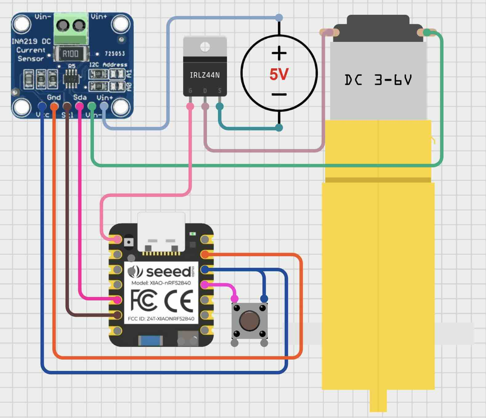

## DC Power measure & control board

This example shows configuration that can measure DC power and turn it on/off.

It uses [Adafruit INA219](https://www.adafruit.com/product/904) (or may use any other INA2XX module), 
IRLZ44N N-channel Mosfet and a DC motor as a load. There is also a button to manually toggle the output.

INA219 measurements can be used to control the output state (on/off) from some controller (i.e. Home Assistant).

Note: maximum voltage for INA219 board in this example, and so the load, is 26V.

### Example layout

Please use this only as an example of how the layout and connections may be done.
The flow of power is: power source -> INA219 -> load -> mosfet -> ground.

Interactive version can be found on [Cirkitdesigner](https://app.cirkitdesigner.com/project/8317dd94-f403-4144-b05d-c76bddbebde9).

## Warning

Working with high voltages may be dangerous, so please take precautions, or ask professional for help.

Also respect the maximum values on all components, as otherwise it can lead
to injury or fire.